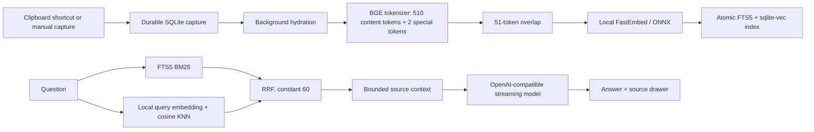

# NotesAI

A local-first Windows desktop app for saving context and asking questions with source-linked answers. Built with Tauri v2, Rust, React, TypeScript, Vite, and Tailwind CSS.

Planning to build on a MacBook? Follow the repository-specific [macOS port plan](docs/MACOS_PORT_PLAN.md). It starts with an Apple Silicon dependency and unsigned-app gate, then covers menu-bar capture, Keychain, cross-platform backups, signing, notarization, and release automation.

Smartphone work is split into realistic platform plans: [Android](docs/ANDROID_PORT_PLAN.md) and [iOS](docs/IOS_PORT_PLAN.md). Both define low-friction capture surfaces, mobile native-dependency gates, lifecycle-safe processing, and the Google Drive synchronization work required for one library across devices.

For a shared library across Windows, macOS, Android, and iOS, follow the [cross-platform shared library plan](docs/CROSS_PLATFORM_SYNC_PLAN.md). It specifies bidirectional Google Drive synchronization, user-controlled cloud deletion, conflicts, encryption, attachment storage, migration from backups, and staged validation gates.

## Download for Windows

Download the current Windows build from [GitHub Releases](https://github.com/chetanbavdhankar/notesAI/releases/latest):

- `NotesAI_0.4.0_x64-setup.exe` — recommended Windows installer
- `notesai.exe` — standalone application executable

The repository tracks all application source code, tests, configuration, lockfiles, icons, and third-party license notices. Generated dependency folders, caches, test screenshots, and compiler output are excluded; they are reproducible from the tracked source and lockfiles.

## Run

Build the Windows installer from this checkout:

```powershell
npm.cmd ci
npm.cmd run desktop:build
```

Before building, install Node.js, Rust's MSVC toolchain, Visual Studio C++ Build Tools with a Windows SDK, and WebView2. The launcher also detects an optional local Rust toolchain under `.tools`; toolchains and build outputs are not included in this repository. The generated installer is `src-tauri/target/release/bundle/nsis/NotesAI_0.4.0_x64-setup.exe`. For development, use `npm.cmd run desktop`. The Windows installer handles WebView2 installation where needed.

```powershell
npm.cmd run dev             # Browser interface preview, without native AI/ingestion
npm.cmd run desktop:build   # Optimized Windows executable and NSIS installer
npm.cmd test                # Browser flow tests using installed Microsoft Edge
npm.cmd run test:native     # Rust storage, retrieval, chunking, settings, streaming tests
```

The desktop/build/test launcher fetches a pinned, SHA-256-verified yt-dlp reader and its licenses if they are absent. The installer includes this reader. A first local embedding run downloads BGE Small EN v1.5 (~134 MB model plus tokenizer files); subsequent inference uses the local cache. An LLM is not included: configure a running local model or a remote profile in Settings.

## Everyday use

1. Copy text, code, or a URL. Press **Win + Alt + S** or **Ctrl + Shift + C**. Both shortcuts capture the current clipboard; copy selected text before invoking them.
2. A native notification confirms the durable capture. Hydration and embedding happen in the background. The feed shows queued, hydrating, indexing, ready, or failed status, with retry for failures.
3. Use **New capture** for manual input and comma-separated tags. Edit and delete captures from the detail view. Edits replace the old search index transactionally.
4. Filter by kind, tag, capture date, or text. Press Enter in search for hybrid retrieval.
5. Choose a model in **Settings**, use **Discover** where supported, and select the active profile. The base URL should already include its API prefix; `/models` and `/chat/completions` are appended once.
6. Ask your library a question. Click a numbered citation to open the actual passage supplied to the model, its capture date, and original URL.

Closing the window leaves the app in the Windows tray so shortcuts keep working. Use **Open NotesAI** or **Quit NotesAI** in the tray menu. Startup shortcut conflicts generate a notification rather than crashing the app.

### Background startup and topic organization

- **Settings → General → Start NotesAI with Windows, in the tray** enables per-user login startup. The switch applies immediately and registers the current executable with `--background`; enable it from the installed app. **Run in background** hides the window immediately. Startup launches without flashing a main window; opening NotesAI again brings the existing process forward. Tray Quit stops capture until the next launch/login. No administrator privileges or Windows service are required.
- **Organize** reviews unorganized notes using the active model, or the separate profile selected in **Settings → Organization**. Click **Suggest topics for remaining notes** to send excerpts one at a time. Only the first suggested topic is preselected; select alternatives or multiple complementary topics, edit names, and **Save topics**. No assignment is saved automatically. Unsaved notes stay unorganized; an empty selection can explicitly mark a note reviewed without a topic.
- Topic names form the main sidebar groups. Source types remain available in a collapsible secondary section. Selecting a topic limits both keyword/vector retrieval and the next chat question; the composer displays this scope. **Edit topics** revises an existing assignment. Editing note content makes it eligible for review again, and stale review saves are rejected.
- Topic assignments and review state are included in compact schema-v2 backups. Older schema-v1 archives remain importable. Rebuilding embeddings is unnecessary when only topics change. Organization uses bounded excerpts, so review long or mixed-subject notes carefully.
- Citation checks cover paragraphs and list items as well as valid source numbers. An uncited answer gets one repair attempt; if that fails, linked excerpts replace it. Numbered buttons open the exact source passage and its note. These checks validate references and coverage, not the truth of an LLM's interpretation.

### Model profiles

Presets include Ollama, LM Studio, OpenRouter, Gemini's OpenAI-compatible endpoint, and a custom endpoint. vLLM works through its OpenAI-compatible server. Anthropic can be used through an OpenAI-compatible adapter/proxy or OpenRouter; the native Anthropic Messages API is not implemented.

Each profile persists `id`, `provider`, `name`, `base_url`, `api_key`, `model_name`, `context_window_limit`, and `temperature`. Top K is configurable from 3 to 15. Model discovery is optional: a model ID can always be entered manually.

Selecting the Ollama provider automatically discovers the server in the desktop app. **Discover** refreshes its installed inventory using `/api/tags`, including models that are not currently loaded. Results appear in an **Installed Ollama models** dropdown, and the detected `/v1` base URL is filled in automatically. A current model selection is retained if it still exists in the inventory; otherwise the first installed model is selected. Empty inventories and unreachable servers have separate messages.

Discovery respects explicit custom addresses, the process and Windows user/system `OLLAMA_HOST` settings, and IPv4/IPv6 loopback defaults. A configured host takes priority over the default preset address. Bind addresses such as `0.0.0.0` are converted to a connectable loopback address. Local discovery bypasses HTTP proxies and has short request timeouts. Keys are never sent to fallback addresses and are cleared if discovery switches to a different server. Ollama must be running; the app does not start it or download LLMs automatically.

### Appearance

Settings now includes **Light**, **Dark**, and **Follow system** modes. Choose Sage, Ocean, Violet, Amber, Rose, or Slate, or pick a custom accent color. Backgrounds, text, borders, panels, buttons, and citations share the palette; custom colors generate coordinated shades with readable text rather than coloring every element with the raw input.

Changes preview immediately. **Save settings** persists appearance in the local JSON file; Cancel, Escape, or closing the dialog restores the saved appearance. Follow system reacts to Windows color-scheme changes. Older settings files gain default appearance settings without replacing their profiles.

Profiles are saved as JSON, including API keys, in the app's private data directory. Keys are masked in the UI but **not encrypted at rest**. Remote profiles send the question, bounded conversation history, and retrieved passages to the selected provider. Captures and embedding inference stay local. Use a local model profile for local generation.

## Storage and pipeline

Default data directory: `%APPDATA%\com.notesai.desktop`.

| File/directory  | Purpose                                                           |
| --------------- | ----------------------------------------------------------------- |
| `knowledge.db`  | Captures, durable job states, chunks, FTS5 and sqlite-vec indices |
| `settings.json` | Model profiles, active profile, retrieval depth                   |
| `models/`       | FastEmbed/Hugging Face model and tokenizer cache                  |

Quit through the tray before backing up the data directory, so SQLite WAL files are checkpointed/closed. `NOTESAI_DATA_DIR` and `NOTESAI_MODEL_CACHE` optionally override the storage locations. The automated native smoke test uses these overrides to keep test content separate from your library.



- SQLite uses WAL, foreign keys, and a busy timeout. Capture jobs survive restarts. Index writes and deletes are transactional. Revision checks prevent an in-flight indexing result from overwriting a newer edit.
- Windows contain up to 510 BGE content tokens, reserving two special tokens within the 512-token model limit. The overlap is 51 tokens. Original Unicode text slices are retained for citations.
- BGE Small generates 384-dimensional vectors. sqlite-vec stores cosine-distance vectors; FTS5 indexes the same passages. Lexical and dense retrieval run concurrently, using separate SQLite connections, then merge through reciprocal rank fusion.
- Captured documents are treated as untrusted source data in the system prompt. Source records contain note ID, chunk ID, title, URL, and timestamp. A conservative UTF-8 byte budget prevents overflowing the configured context window. This can include fewer passages than Top K.
- SSE is decoded across arbitrary network boundaries, including split UTF-8. Citation IDs and paragraph/list coverage are validated after streaming, followed by one repair attempt and a source-excerpt fallback if necessary. Validation does not prove that a model's interpretation is correct.
- Chat history is held for the current app session; notes and profiles persist across restarts.

## Hydration scope

- Plain text and code are retained directly.
- HTTP(S) pages use static HTML parsing, common boilerplate removal, main/article selection, OpenGraph metadata, and Markdown conversion. No browser login session is imported and JavaScript is not executed. Heavy client-rendered pages may provide limited text.
- X/Twitter and Reddit use the public page and OpenGraph data. Sign-in walls, anti-bot blocks, and private posts may prevent extraction. The original URL remains saved and failures can be retried.
- YouTube uses bundled yt-dlp for metadata and available English JSON3 captions. Missing transcripts retain title and description with a visible notice. Availability depends on YouTube and the video; no guarantee is made for every URL. The reader is pinned in `scripts/fetch-reader.mjs` and can be upgraded with a new official release and checksum.
- Captures are capped at 2 MB; HTML responses at 5 MB. Single-worker inference limits memory use. Very large-library performance has not been benchmarked; the current feed loads capture records in memory.

## Validation performed

- TypeScript typecheck and Vite production build.
- Native Rust tests: RRF ordering, Unicode chunk boundaries, FTS5 and sqlite-vec roundtrip, transactional deletion, settings replacement, endpoint construction, context overflow rejection, UTF-8 streaming, invalid-citation rejection.
- Real downloaded BGE model: two documents embedded, indexed, and queried through hybrid retrieval; the relevant astronomy passage ranked first.
- Playwright in Edge: capture/edit/filter/reload/delete; model-setting persistence; accurate browser-preview chat limitations.
- Actual Tauri/WebView2 application: capture → background ONNX indexing → model discovery → hybrid retrieval → streaming through a local OpenAI-compatible **test server** → citation click → exact source drawer. See `artifacts/native-chat.png`.
- Version 0.2: actual running Ollama server discovery matched all eight installed model names, model selection survived reload, and appearance persisted in the native app. See `artifacts/ollama-settings.png`. Additional tests cover host normalization, fallback, empty inventory, credentials isolation, legacy settings migration, and appearance preview/cancel/system-mode behavior.

To repeat the model test:

```powershell
$env:NOTESAI_TEST_MODEL_CACHE = "$PWD/.tools/test-models"
npm.cmd run test:native -- real_embedding_roundtrip -- --ignored --nocapture
```

To repeat the native UI test, build a debug executable and run `node scripts/native-smoke.mjs`. The script uses localhost port 9223 for WebView2 inspection, a temporary data directory, and a mock model server. It closes the test app afterward.

Set `NOTESAI_TEST_OLLAMA=1` to additionally check the real local Ollama inventory; set `NOTESAI_SMOKE_EXE=src-tauri/target/release/notesai.exe` to test the release executable. Close other NotesAI instances before running this isolated test because the app enforces a single instance.

Live remote providers, OS hotkey capture/toast delivery, and the breadth of public YouTube/social-site extraction require environment-specific checks. No API credentials are bundled. The installer is unsigned.

## Source map and references

- `src-tauri/src/db.rs`, `schema.sql`: local persistence and hybrid retrieval primitives.
- `src-tauri/src/ingest.rs`: hydration, tokenizer windows, ONNX inference.
- `src-tauri/src/llm.rs`: model settings, prompt assembly, streaming and citation constraints.
- `src-tauri/src/lib.rs`: commands, durable worker, tray, clipboard and global shortcuts.
- `src/App.tsx`, `components.tsx`, `api.ts`: React UI, Markdown/citations, typed desktop bridge and explicit browser preview.
- Primary implementation references: [Tauri global shortcuts](https://v2.tauri.app/plugin/global-shortcut/), [sqlite-vec Rust example](https://github.com/asg017/sqlite-vec/blob/main/examples/simple-rust/demo.rs), [FastEmbed](https://docs.rs/crate/fastembed/4.9.1), [bundled yt-dlp release](https://github.com/yt-dlp/yt-dlp/releases/tag/2026.08.19).

The yt-dlp executable's upstream and third-party licenses are included in `vendor/` and installed with the app.

## Version 0.3.3

The icon now uses a full-bleed, sharp-edged square canvas with one large bordered note and sparkle. Removing transparent margins and the extra stacked card makes the mark larger and clearer in the app, on the desktop, and at small Windows icon sizes. The in-app version continues to adapt to the selected theme.

## Version 0.3.2

NotesAI now has a calm matte layered-notes and AI-sparkle icon with a rigid rounded-square frame. The operating-system artwork appears in the Windows executable, shortcuts, installer, window chrome, and system tray, with platform-specific sizes generated from the vector source. The in-app mark uses the same geometry and adapts to the theme selected in Settings.

## Version 0.3.1

Introduced custom NotesAI branding and replaced the original solid-color tray placeholder.

## Version 0.3.0

Ollama chat uses its native streaming API with thinking disabled for supported models, avoiding reasoning-only output-budget exhaustion. Streaming handles fragmented UTF-8 and distinguishes partial responses from complete answers. Chat uses compact right-aligned questions and left-aligned replies with highlighted source buttons. Settings has separate Models, Appearance, Retrieval and Backup sections.

Google Drive sign-in, compact scheduled backups and portable export/restore are available in Settings. Follow [the one-time setup guide](docs/GOOGLE_DRIVE_SETUP.md). Live Google authorization/upload remains unverified without the user's OAuth configuration. Cross-device live sync is not included.
